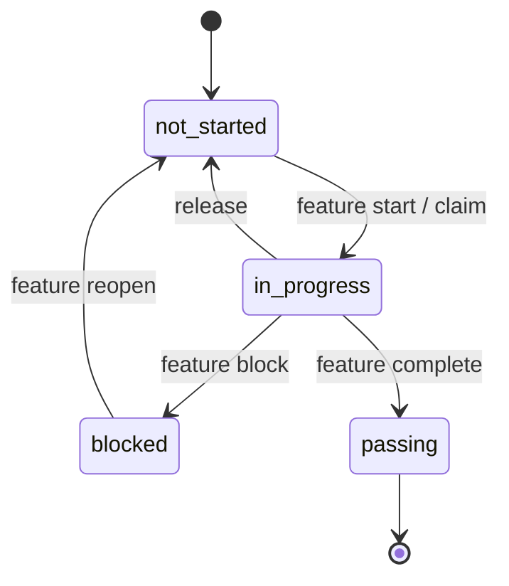
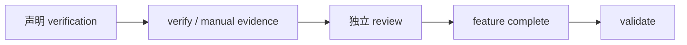
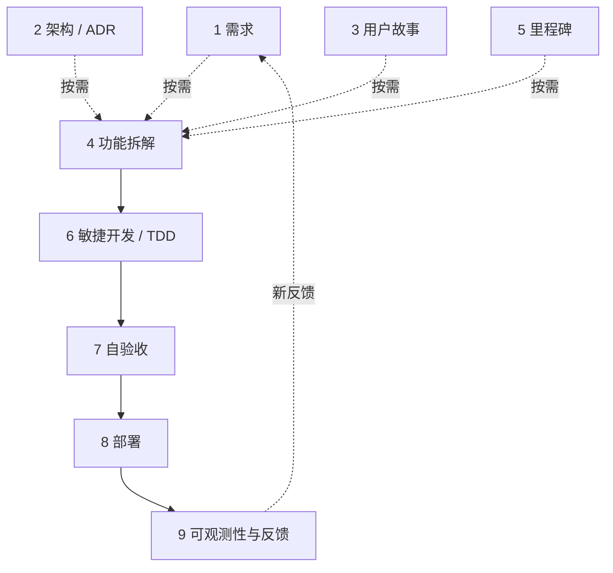

## 仓库是唯一状态源

SDLC Harness 不依赖外部项目管理服务。协议、计划、执行状态和证据都与代码一起进入 Git 历史。

| 内容 | 状态源 |
| --- | --- |
| Agent 工作协议 | `AGENTS.md`、`docs/workflow/` |
| 里程碑与功能 | `feature_list.json` |
| 项目策略 | `harness.config.json` |
| 需求与设计 | `docs/product/`、`docs/architecture/`、`docs/adr/` |
| 会话交接 | `progress.md` |
| 审计事件 | `.harness/events/*.jsonl` |

## 功能状态机

- `not_started`：依赖通过后可以开始。
- `in_progress`：由一个有效 claim 保护，受 owner WIP 上限约束。
- `blocked`：记录了无法继续的外部原因，不占用 claim。
- `passing`：所有完成门禁已经满足，默认不得悄悄回退。

## claim、owner 与 actor

owner 是责任归属，actor 用于区分同一 owner 启动的不同 Agent 会话。claim 始终按功能互斥，并带有租约截止时间。

Solo 模式下，`verify` 按需临时 claim，单人用户通常感觉不到租约。Team 模式要求显式 claim；过期后才能被其他 owner 接管。两种模式都会拒绝与他人的活跃 claim 竞争写入。

## 完成是证据链

- 自动验证记录命令、退出码、时间和 commit SHA。
- 手工验证绑定明确的 manual verification 索引和观察说明。
- review 绑定当前 commit，评审者不能是 claim owner，并且必须晚于最新验证。
- 制品 approval 绑定文件 SHA-256 内容哈希；内容变化后失效。
- `feature complete` 原子检查单个功能的完成条件。
- `validate` 审核全仓库结构、依赖、阶段、证据和追溯。

## 九阶段工作流

工作流不是每次从第 1 阶段机械执行。功能拆解、敏捷实现和自验收构成核心循环；需求、架构、用户故事和里程碑按风险与范围进入；部署和可观测性由项目配置决定。

`deploymentMode` 和 `observabilityMode` 可以让没有部署目标或运行时受众的库、CLI 与内部脚本跳过不适用阶段。

## 原子写入与并发

功能创建、claim、验证证据和生命周期更新使用原子写入与 revision 检查。检测到并发修改时，安全路径会重新读取并合并一次，或明确拒绝覆盖，而不是静默丢失另一个 Agent 的改动。

## 工具边界

SDLC Harness 会执行你声明的命令并审核证据，但不会判断需求是否正确、替代测试框架、自动决定产品价值或提供真正的分布式锁。Git 跨机器 claim 仍通过提交和推送协调。
