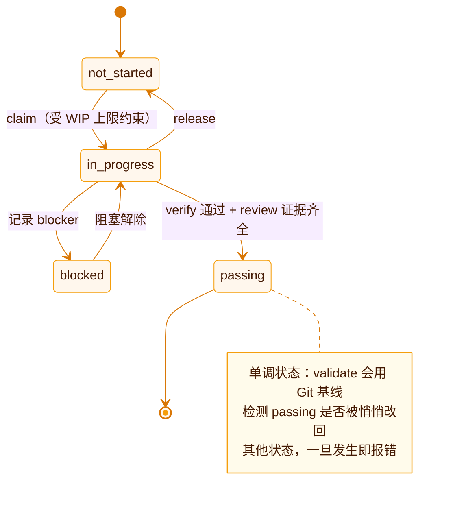
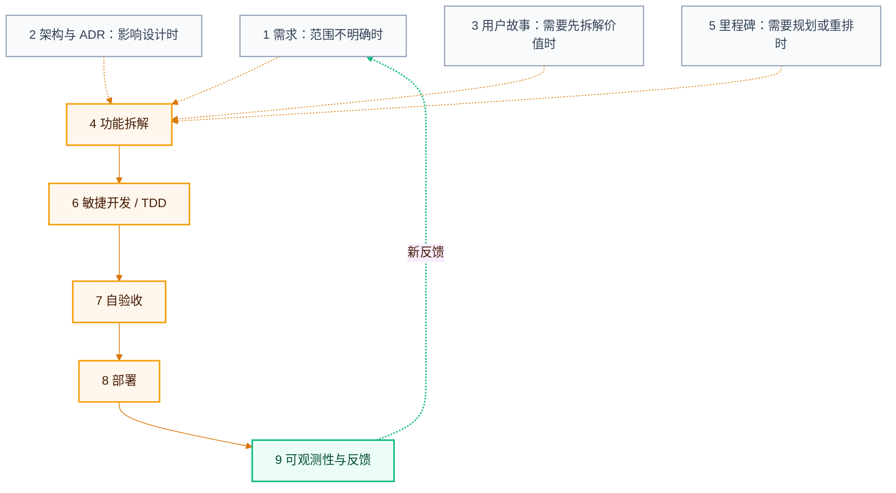

## 仓库是唯一状态源

SDLC Harness 不依赖外部项目管理服务。它把工作协议和当前状态直接写入 Git 仓库。

| 文件或目录 | 用途 |
| --- | --- |
| `AGENTS.md` | 告诉编码 Agent 如何进入流程、选择任务和结束会话 |
| `feature_list.json` | 保存里程碑、功能、依赖、状态、claim 和证据 |
| `feature_list.schema.json` | 定义状态文件的机器可读格式 |
| `harness.config.json` | 配置协作模式、默认 owner、ADR 要求等项目规则 |
| `progress.md` | 保存跨会话的进度检查点 |
| `docs/workflow/` | 提供九个 SDLC 阶段的操作指南 |
| `docs/adr/` | 保存架构决策记录 |
| `.harness/events/` | 保存认领、验证等操作的追加式审计日志 |

## 功能状态

每个功能处于以下状态之一：

| 状态 | 含义 | 下一步 |
| --- | --- | --- |
| `not_started` | 尚未开始，可以在依赖通过后被认领 | 认领并开始实现 |
| `in_progress` | 某个 owner 正在实现 | 完成代码、测试和评审 |
| `blocked` | 当前无法继续 | 记录阻塞原因并解决依赖或外部问题 |
| `passing` | 已满足完成条件 | 保持通过状态并进入提交、CI 或部署 |

<Important>
  `passing` 是单调状态。一个曾经通过的功能不能在后续审核中悄悄退回其他状态。需要修改已完成功能时，创建新的功能来追踪变更。
</Important>

## 证据不是一句声明

功能标记为 `passing` 前至少需要：

- 一条实际验证证据。推荐使用 `sdlc-harness verify <feature-id>` 生成。
- 一条 `kind: "review"` 的评审证据。

`verify` 生成的测试证据包含命令、退出码、时间和当前 commit SHA。这样本地、CI 和后续 Agent 可以判断“什么代码、用什么命令、在什么时候”通过了验证。

## 九阶段工作流

工作流不是每次都从第一阶段顺序执行。第 4、6、7、8、9 阶段构成核心交付循环，其余阶段按变更需要进入。

`AGENTS.md` 中的 Routing Map 会根据新能力、小修复、生产事故或继续已有功能，帮助 Agent 选择入口。

## 工具负责什么

SDLC Harness 是协议与验证层：

- 它会运行你为功能声明的验证命令，但不是测试框架。
- 它会检查证据与状态是否一致，但不能证明需求本身正确。
- 它会管理 claim 和 worktree，但不是托管项目管理服务。
- 它会生成 CI 模板，但真实构建、测试和部署命令仍由项目提供。

这条边界很重要：工具保证过程可追踪、规则可执行，不替你决定产品是否有价值。
