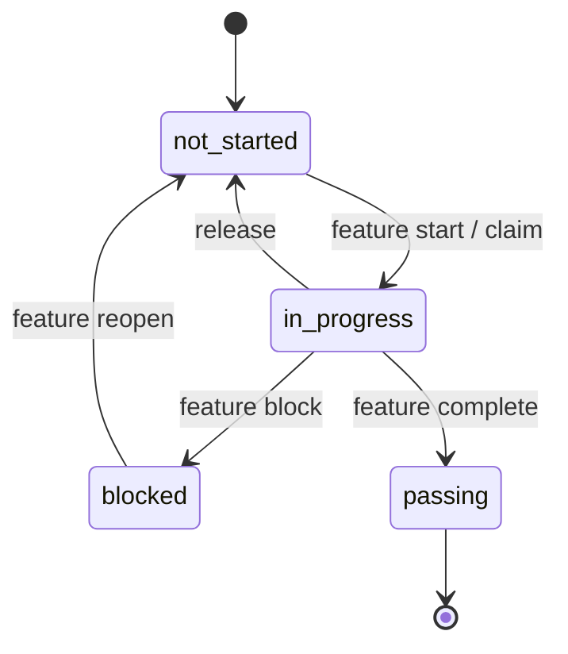
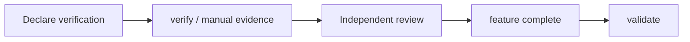
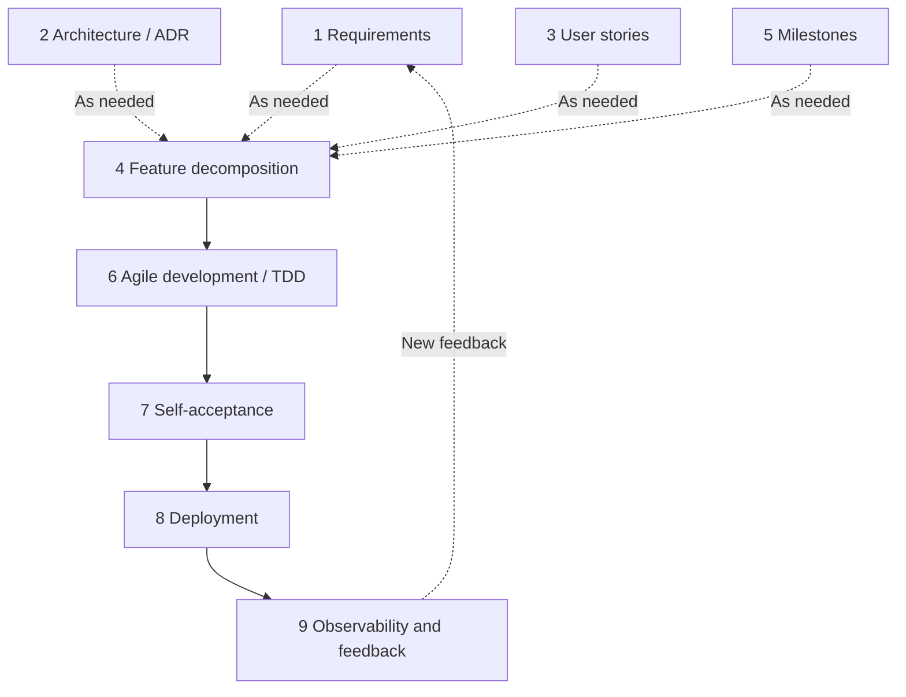

## The repository is the single source of truth

SDLC Harness does not depend on an external project management service. The protocol, plans, execution state, and evidence all enter Git history with the code.

| Content | Source of truth |
| --- | --- |
| Agent working protocol | `AGENTS.md`, `docs/workflow/` |
| Milestones and features | `feature_list.json` |
| Project policy | `harness.config.json` |
| Requirements and design | `docs/product/`, `docs/architecture/`, `docs/adr/` |
| Session handoff | `progress.md` |
| Audit events | `.harness/events/*.jsonl` |

## Feature state machine

- `not_started`: Can start after its dependencies pass.
- `in_progress`: Protected by a valid `claim` and subject to the `owner`'s WIP limit.
- `blocked`: Records an external reason that prevents progress and does not consume a `claim`.
- `passing`: All completion gates have been satisfied; by default, the state cannot silently regress.

## `claim`, `owner`, and `actor`

An `owner` identifies responsibility. An `actor` distinguishes separate agent sessions started by the same `owner`. A `claim` is always mutually exclusive per feature and includes a lease expiration time.

In Solo mode, `verify` creates a temporary `claim` when needed, so a single user usually does not notice the lease. Team mode requires an explicit `claim`, and another `owner` can take over only after the lease expires. Both modes reject writes that compete with another `owner`'s active `claim`.

## Completion is an evidence chain

- Automated verification records the command, exit code, execution time, and commit SHA.
- Manual verification binds an explicit manual verification index to an observation.
- A review binds to the current commit, cannot be performed by the `owner` of the feature's `claim`, and must follow the latest verification.
- An artifact approval binds to the file's SHA-256 content hash and becomes invalid when the content changes.
- `feature complete` atomically checks the completion conditions for one feature.
- `validate` audits repository-wide structure, dependencies, stages, evidence, and traceability.

## Nine-stage workflow

The workflow does not mechanically start at stage 1 every time. Feature decomposition, agile implementation, and self-acceptance form the core loop. Requirements, architecture, user stories, and milestones enter based on risk and scope. Project configuration determines whether deployment and observability apply.

`deploymentMode` and `observabilityMode` let libraries, CLIs, and internal scripts without deployment targets or runtime audiences skip stages that do not apply.

## Atomic writes and concurrency

Feature creation, `claim` operations, verification evidence, and lifecycle updates use atomic writes and revision checks. When SDLC Harness detects a concurrent edit, the safe path rereads and merges once or explicitly refuses to overwrite the change instead of silently discarding another agent's work.

## Tool boundaries

SDLC Harness executes the commands you declare and audits their evidence. It does not determine whether requirements are correct, replace a test framework, decide product value automatically, or provide a true distributed lock. Cross-machine `claim` operations still coordinate through Git commits and pushes.
