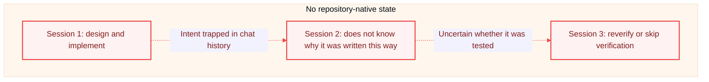
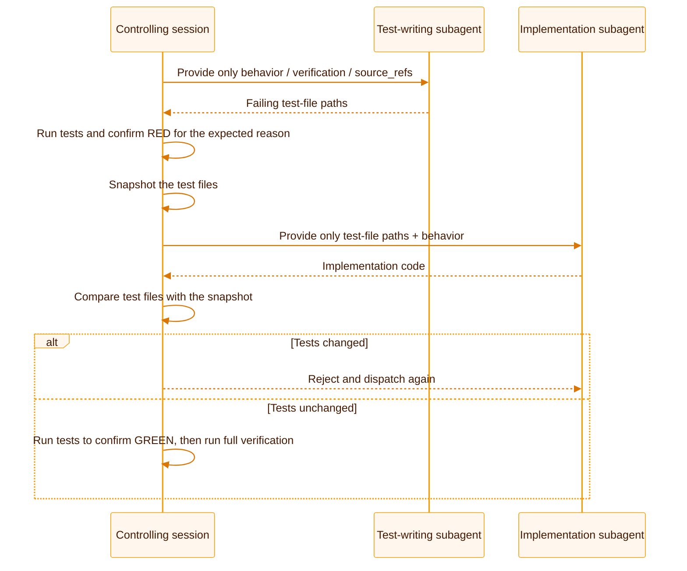

This page answers a more fundamental question: **What specifically goes wrong without SDLC Harness?** Each section begins with a failure mode that occurs in real work, then explains how the corresponding mechanism reduces, detects, or blocks it.

## Failure mode 1: progress exists only in conversation

Coding-agent sessions have boundaries. When a conversation ends, context is compacted, or a different agent continues the same task, information such as why a change was made, how far the work progressed, and what remains disappears if it exists only in chat history. The next person or agent must reread the code, infer the intent, or repeat analysis that was already done.

SDLC Harness writes the reason for a change, current progress, and verification state directly into the repository. `feature_list.json` records state, dependencies, and evidence; `source_refs` links a feature back to the original requirement or ADR; and `progress.md` preserves cross-session checkpoints. A new session does not need the full conversation history. It only needs the files specified by `AGENTS.md`.

## Failure mode 2: “done” is only a self-reported claim

Agents and people both tend to report that work is complete or tests passed, but the statement alone proves nothing. When completion is only a natural-language description, acceptance becomes a matter of trusting the report.

SDLC Harness does not accept declarative completion. `sdlc-harness verify <feature-id>` executes the verification commands declared by the feature and writes the command, exit code, timestamp, and current commit SHA as evidence. A handwritten “passed” record cannot stand in for actual command execution. The `[pass-gate]` check in `validate` goes further: a `passing` feature must have both verification evidence and an independent `kind: "review"` evidence record. Passing tests do not replace review, and review does not replace actually running the tests.

<Note>
  These two evidence types answer different questions: “Did the command actually run and succeed?” and “Did someone inspect the implementation against the acceptance criteria?” Neither can replace the other.
</Note>

## Failure mode 3: completed state silently regresses

A feature marked `passing` today does not remain safe forever. A later change can break it without anyone noticing that its state was changed back to `in_progress` or removed. A check that sees only the current file cannot detect this regression.

The monotonicity check in `validate` (`passing_is_monotonic`) compares the current state with a Git baseline. It prefers `HARNESS_BASE_REF`/`GITHUB_BASE_REF` or `origin/main`/`main`, and falls back to a local snapshot only when no baseline is available. In a fresh CI checkout, this check can detect that a previously passing feature no longer passes only when CI fetches a resolvable baseline and sets `HARNESS_BASE_REF` or `GITHUB_BASE_REF`; see [CI and GitHub integration](/guides/ci-and-github). It does not rely on history cached on one developer machine.

## Failure mode 4: the implementer also writes the tests

When the same person or agent writes both the implementation and its tests, the incentives are inherently misaligned. Assertions may be relaxed, edge cases may be skipped, or tests may verify only that the code does not crash rather than that the behavior is correct. This is not necessarily dishonesty; one perspective has difficulty acting as both competitor and referee.

The default `testStrategy: "isolated-tdd"` physically separates the roles. One subagent receives only the feature's `behavior`, `verification`, and `source_refs`, and writes failing tests without seeing an implementation plan. The controlling session confirms that the tests first fail for the expected reason (RED) and snapshots the test files. A second subagent receives only the test-file paths and implements the behavior without access to the first agent's reasoning or permission to change the assertions. After the tests turn green, the controlling session compares the test files with the snapshot and rejects the implementation if they changed.

Clearly small features with no branching logic or external dependencies can skip the subagent split and stay within one session. The refactoring step and review gate remain required under every `testStrategy`.

## Failure mode 5: multiple agents claim the same work

Running multiple agents in parallel directly increases throughput, but without coordination, two agents can select the same apparently available feature, implement it twice, and leave someone to merge conflicts or discard duplicate work.

SDLC Harness uses a `claim` and lease to make claiming atomic. `claim --next` selects only a `not_started` feature whose dependencies are all `passing` and which has no active `claim`. `wip_limit_per_owner`, which defaults to 1, limits how many features one `owner` can open at once and discourages starting work without finishing it. Git does not provide a real-time cross-machine lock, so two machines can still claim the same feature locally. `claim --push` defers conflict detection until the push: it commits and pushes the `claim`; if the push is rejected, it discards the local `claim`, synchronizes, and automatically claims the next ready feature. This detects the conflict at the moment it becomes real instead of pretending a prior lock can prevent it. A separate `workspace create` gives each `claim` an isolated `worktree` and branch so parallel agents do not overwrite one another in a shared working tree.

## Failure mode 6: rules exist only in documentation

Rules such as “run tests before committing” and “completion requires review” are only as reliable as people's memory when they exist solely in a contribution guide. People can forget, and agents are even more likely to lose the constraint during a long session.

`sdlc-harness validate` turns those rules into a command with a nonzero exit code on failure. When the local `.githooks/pre-commit` hook and generated CI workflow are enabled, they execute the same audit logic. A noncompliant state then returns a nonzero exit code and can block a commit or merge. Local and CI results can still differ when their checked-out history, baseline refs, configuration, or environment differ.

## What changes in practice

These mechanisms are not entirely new inventions. They apply established engineering practices to coding-agent collaboration: where state belongs, how completion is demonstrated, how concurrency is coordinated, and how regressions are detected. The table shows the practical difference between working without repository-native governance and working with SDLC Harness.

| Stage | Without these mechanisms | With SDLC Harness |
| --- | --- | --- |
| Where current state lives | Chat history, issue descriptions, and developers' heads, which often disagree | `feature_list.json` is the single source of truth that every session reads |
| How “done” is demonstrated | A statement that tests passed or the change should work | An evidence record with command, exit code, timestamp, and commit SHA, plus an independent review record |
| Whether local and CI rules match | Local and CI checks run separately and can drift | The local Git hook and CI run the same `validate` logic |
| How regressions are detected | Someone must remember or happen to find an old record | `validate` compares against a resolvable Git baseline; a fresh CI checkout must fetch it and set `HARNESS_BASE_REF` or `GITHUB_BASE_REF` |
| How agents or developers avoid claiming the same task | Verbal coordination or conflict resolution afterward | A `claim` makes selection atomic; conflicts are detected at push time and work is reassigned automatically instead of relying on an early lock |
| Whether the implementer writes the tests | One perspective acts as both competitor and referee, making assertions easier to relax | The default strategy separates two agents that do not share implementation reasoning and snapshots test files to prevent later weakening |

These differences reflect several well-established software-engineering practices: consolidate mutable runtime state in a declarative, replayable location instead of scattering it across sources that drift; make completion conditions machine-checkable instead of relying only on human confirmation; trace evidence to specific commands and artifacts instead of accepting a retelling; and use optimistic concurrency by performing the most expensive conflict check when a change is actually submitted rather than acquiring a heavyweight lock at the start. SDLC Harness brings these practices into one repository and one set of exit codes, without requiring a separate coordination service or depending on every team member to remember the same conventions.

## What the mechanisms solve together

Individually, `claim`, evidence, monotonicity checks, and isolated TDD are narrow mechanisms. Together, they turn trust in agent collaboration from self-reporting into a question that can be answered from verifiable repository records.

<CardGroup cols={2}>
  <Card title="Recoverable state" icon="rotate">
    After an interruption, the next session can recover the complete context from the repository without relying on chat history.
  </Card>
  <Card title="Evidence-backed completion" icon="fingerprint">
    A `passing` feature must be backed by verification commands that actually ran and an independent review record.
  </Card>
  <Card title="Visible regressions" icon="arrow-trend-down">
    Git baseline comparison can detect `status` regression in a [fresh CI checkout](/guides/ci-and-github) when CI fetches a resolvable baseline and sets `HARNESS_BASE_REF` or `GITHUB_BASE_REF`.
  </Card>
  <Card title="Executable rules" icon="gavel">
    When local hooks and CI are enabled, the same audit returns a nonzero exit code for noncompliant state and can block a commit or merge.
  </Card>
</CardGroup>

<Card title="See how it works" icon="diagram-project" href="/concepts/how-it-works">
  Explore the repository state, feature lifecycle, and nine-stage workflow in detail.
</Card>
