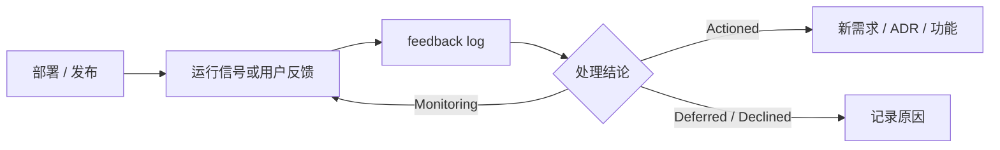

九阶段工作流的部署与可观测性要求由项目类型决定。库、CLI、内部脚本和在线服务不应被迫使用同一条路径。

## 阶段配置

```json
{
  "deploymentMode": "required",
  "observabilityMode": "feedback-only"
}
```

| 字段 | 取值 | 含义 |
| --- | --- | --- |
| `deploymentMode` | `required` | 必须完成部署阶段 |
|  | `optional` | 有部署目标时执行 |
|  | `none` | 该项目没有部署阶段 |
| `observabilityMode` | `runtime` | 需要运行时指标、日志或告警及反馈闭环 |
|  | `feedback-only` | 不要求运行时观测，但仍维护反馈日志 |
|  | `none` | 阶段 9 不适用 |

## 记录反馈

```bash
npx @caesarlo/sdlc-harness feedback log \
  --source "support-ticket-182" \
  --severity S2 \
  --observation "结账超时后用户无法安全重试" \
  --disposition Actioned \
  --detail "创建 M2-CHECKOUT-004"
```

[查看 `feedback log` 参数说明 →](/reference/command-feedback#log)

严重级别为 `S1`、`S2`、`S3`、`S4`；处理结论为 `Actioned`、`Deferred`、`Declined`、`Monitoring`。`Deferred` 和 `Declined` 必须在 detail 中解释原因。

命令会把新条目写到 `docs/product/feedback-log.md` 顶部。手工编辑也可以，但 `validate` 的 `[feedback-log]` 会检查日期、来源、观察、严重级别和处理结论。

## 从反馈回到开发



反馈条目不自动创建功能。对于 `Actioned` 条目，应在 detail 中记录对应功能或需求 ID，保持决策可追踪。
