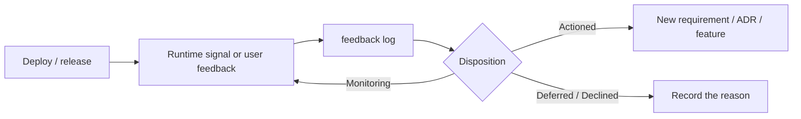

Deployment and observability requirements in the nine-stage workflow depend on the project type. Libraries, CLIs, internal scripts, and online services should not be forced onto the same path.

## Stage configuration

```json
{
  "deploymentMode": "required",
  "observabilityMode": "feedback-only"
}
```

| Field | Value | Meaning |
| --- | --- | --- |
| `deploymentMode` | `required` | The deployment stage must be completed |
|  | `optional` | Run it when the project has a deployment target |
|  | `none` | The project has no deployment stage |
| `observabilityMode` | `runtime` | Runtime metrics, logs, or alerts and a feedback loop are required |
|  | `feedback-only` | Runtime observability is not required, but the feedback log is still maintained |
|  | `none` | Stage 9 does not apply |

## Record feedback

```bash
npx @caesarlo/sdlc-harness feedback log \
  --source "support-ticket-182" \
  --severity S2 \
  --observation "Users cannot retry safely after checkout times out" \
  --disposition Actioned \
  --detail "Created M2-CHECKOUT-004"
```

[See the `feedback log` options →](/reference/command-feedback#log)

Severity values are `S1`, `S2`, `S3`, and `S4`. Disposition values are `Actioned`, `Deferred`, `Declined`, and `Monitoring`. For `Deferred` and `Declined`, explain the reason in `detail`.

The command writes a new entry at the top of `docs/product/feedback-log.md`. You can also edit the file manually, but the `[feedback-log]` check in `validate` checks the date, source, observation, severity, and disposition.

## Return from feedback to development



A feedback entry does not create a feature automatically. For an `Actioned` entry, record the corresponding feature or requirement ID in `detail` to preserve traceability.
