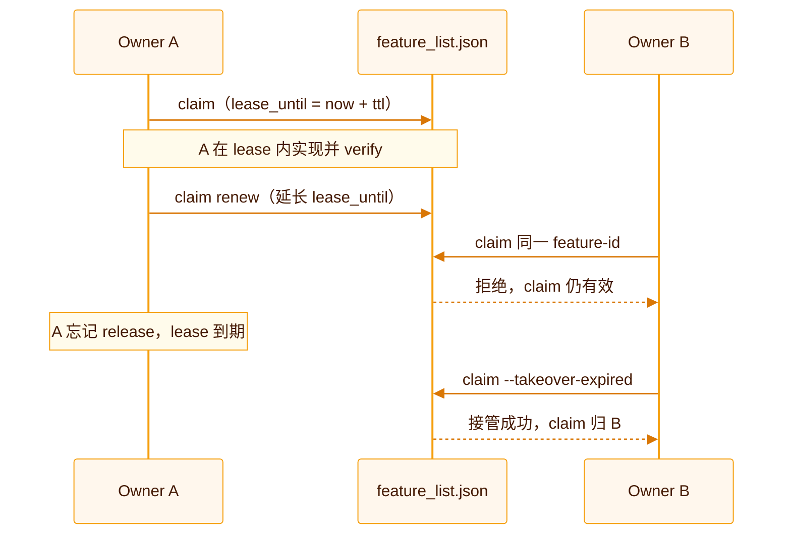
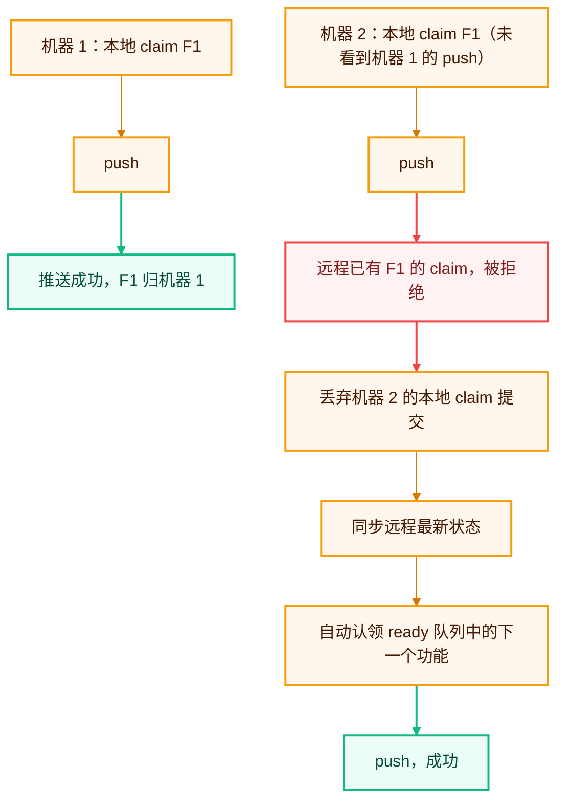

## 选择协作模式

在 `harness.config.json` 中设置：

```json
{
  "collaborationMode": "team",
  "defaultOwner": "your-name"
}
```

| 模式 | 适合场景 | claim 行为 |
| --- | --- | --- |
| `solo` | 一个人或单个 Agent 会话为主 | `verify` 自动认领并释放 |
| `team` | 多人、多 Agent 或多机器并行 | 你必须显式认领，`verify` 不会代管 claim |

## claim 与租约



认领一个功能：

```bash
npx sdlc-harness claim <feature-id> --owner alice --actor codex-1 --ttl 120
```

- `owner` 表示对功能负责的人或团队身份。
- `actor` 用于区分同一 owner 下的多个 Agent 会话。
- `ttl` 是租约分钟数，默认 120 分钟。
- 功能 ID 始终是互斥单位。两个 actor 不能同时认领同一个功能。

长时间工作时续期：

```bash
npx sdlc-harness claim renew <feature-id> --owner alice --ttl 120
```

租约已过期时，新 owner 可以接管：

```bash
npx sdlc-harness claim <feature-id> --takeover-expired --owner bob
```

## WIP 上限

`feature_list.json` 的 `rules.wip_limit_per_owner` 控制每个 owner 同时可进行的功能数，默认是 1。

这个规则会在 claim 时即时检查，也会在 `validate` 的 `[pass-gate]` 中复查。它避免一个开发者或 Agent 同时开启过多工作却没有完成任何一项。

## 跨机器认领

```bash
npx sdlc-harness claim <feature-id> --owner alice --push
```

`--push` 会提交并推送 claim，默认使用 `origin/main`。可以通过 `--remote` 和 `--branch` 修改目标。

Git 不是实时锁。两台机器可能在本地同时认领同一功能。第二次 push 被远程拒绝时，工具会撤销无法推送的本地 claim、同步远程状态，并尝试认领 ready 队列中的下一个功能。



## 独立 workspace

```bash
npx sdlc-harness workspace create <feature-id> --base main
npx sdlc-harness workspace status
```

每个 workspace 位于独立 worktree 和 `feature/<id>` 分支，适合多个 Agent 并行实现不同功能。

清理过期或已释放 claim 对应的 workspace：

```bash
npx sdlc-harness workspace prune
```

工具不会删除仍有有效 claim 的 workspace。发现未提交或未推送内容时，它会跳过并报告原因。

## GitHub 仓库治理检查

```bash
npx sdlc-harness provider github check
```

命令检查分支保护、必需状态检查、强制推送限制、`CODEOWNERS` 和 ruleset。

结论有三种：

- `PASS`：已确认满足要求。
- `FAIL`：已确认缺失或不合规，命令以失败结束。
- `UNKNOWN`：当前 token 权限不足，无法确认。它是警告，不会被当作失败。

详细解释见[审核与结论](/reference/review-results#github-仓库治理结论)。
