SDLC Harness 是一个仓库原生的软件开发生命周期治理工具。它把需求、架构决策、功能状态、依赖关系和验证证据与代码放在一起，并用可执行检查阻止不完整或不一致的交付。

```bash
npx sdlc-harness adopt
```

<CardGroup cols={2}>
  <Card title="为什么需要它" icon="circle-question" href="/concepts/why-sdlc-harness">
    编码 Agent 协作中真实发生的失效模式，以及每个机制具体解决了什么。
  </Card>
  <Card title="5 分钟接入" icon="rocket" href="/quickstart">
    在现有仓库或空仓库中安装并完成第一次检查。
  </Card>
  <Card title="看懂审核结论" icon="clipboard-check" href="/reference/review-results">
    了解每类检查、通过标准和失败后的处理方式。
  </Card>
  <Card title="完整日常流程" icon="list-check" href="/guides/daily-workflow">
    从创建功能到验证、评审和提交。
  </Card>
</CardGroup>

## 它解决什么问题

编码 Agent 很擅长快速修改代码，但跨会话工作容易失去上下文：为什么要改、做到哪一步、验证是否真实发生，常常只存在于聊天记录里。

SDLC Harness 让仓库成为唯一状态源：

- `feature_list.json` 保存里程碑、功能、依赖、状态和证据。
- `AGENTS.md` 与 `docs/workflow/` 告诉编码 Agent 应遵循什么流程。
- `sdlc-harness verify` 真正执行功能声明的验证命令并记录结果。
- `sdlc-harness validate` 审核仓库状态，并用非零退出码阻止不合规提交。
- `.harness/events/` 保留可跨机器同步的操作审计记录。

## 最重要的特点

<CardGroup cols={2}>
  <Card title="不绑定 Agent" icon="robot">
    Codex、Claude Code 和其他能够读取仓库文件的编码 Agent 都可以使用同一套协议。
  </Card>
  <Card title="结论可执行" icon="shield-check">
    本地 Git hook 和 CI 运行相同检查，不依赖人工记忆完成规则。
  </Card>
  <Card title="证据可追溯" icon="fingerprint">
    测试证据包含命令、退出码、记录时间和 commit SHA，不能只写一句“测试通过”。
  </Card>
  <Card title="适合并行协作" icon="people-group">
    claim、租约、WIP 上限和独立 worktree 降低多人或多 Agent 冲突。
  </Card>
  <Card title="测试与实现互相隔离" icon="flask">
    默认 `testStrategy: "isolated-tdd"` 让一个子 Agent 只写失败测试，另一个子 Agent 只拿测试路径实现代码，防止 Agent 为通过测试而弱化断言或篡改测试。
  </Card>
</CardGroup>

## 一次交付如何通过

```mermaid placement="top-right" actions={true}
%%{init: {"flowchart": {"curve": "basis"}, "theme": "base", "themeVariables": {"fontFamily": "Inter, ui-sans-serif, system-ui, sans-serif", "primaryColor": "#FFF7ED", "primaryBorderColor": "#F59E0B", "primaryTextColor": "#451A03", "lineColor": "#D97706", "tertiaryColor": "#FFFBEB"}}}%%
flowchart LR
  A["定义里程碑和功能"] --> B["认领一个可开发功能"]
  B --> C["实现并运行 verify"]
  C --> D["记录 review 证据"]
  D --> E["标记 passing"]
  E --> F["运行 validate"]
  F -->|"通过"| G["提交 / CI / 部署"]
  F -->|"失败"| C
  classDef brand fill:#FFF7ED,stroke:#F59E0B,color:#451A03,stroke-width:2px
  classDef success fill:#ECFDF5,stroke:#10B981,color:#064E3B,stroke-width:2px
  classDef decision fill:#FFFBEB,stroke:#D97706,color:#451A03,stroke-width:2px
  class A,B,C,D,E brand
  class F decision
  class G success
  linkStyle 5 stroke:#10B981,stroke-width:2px
  linkStyle 6 stroke:#EF4444,stroke-width:2px
```



<Note>
  `verify` 负责运行命令和记录测试证据；`validate` 负责审核状态与证据是否符合规则。两者用途不同，通常都需要运行。
</Note>

## 适合谁

- 希望让编码 Agent 跨会话持续工作的开发者。
- 希望本地与 CI 使用同一套完成标准的团队。
- 希望功能状态、架构决策和验证证据随 Git 历史保留的项目。

<Card title="现在开始" icon="arrow-right" href="/quickstart">
  把 SDLC Harness 接入你的仓库，并完成第一次 `validate`。
</Card>
