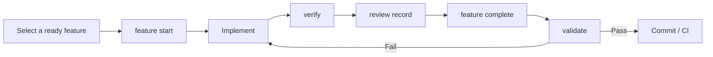

SDLC Harness is a repository-native SDLC governance tool for developers and coding agents. It keeps requirements, architecture decisions, feature state, dependencies, and verification evidence with the code, then uses executable gates to prevent incomplete or inconsistent delivery.

```bash
npx @caesarlo/sdlc-harness adopt
```

[Read the `adopt` command reference →](/reference/command-repository#adopt)

<CardGroup cols={2}>
  <Card title="Get started in 10 minutes" icon="rocket" href="/quickstart">
    Generate the protocol in an existing or empty repository, enable the Git hook, and complete your first feature.
  </Card>
  <Card title="Why use it" icon="circle-question" href="/concepts/why-sdlc-harness">
    Learn about common failure modes when coding agents work across sessions or in parallel.
  </Card>
  <Card title="Daily workflow" icon="list-check" href="/guides/daily-workflow">
    Follow the full path from selecting work through verification, review, completion, and session closeout.
  </Card>
  <Card title="Command reference" icon="terminal" href="/reference/commands">
    Look up every command, option, prerequisite, and state transition.
  </Card>
</CardGroup>

## What it solves

Coding agents can change code quickly, but recurring problems appear when work spans sessions, devices, or multiple agents: context remains trapped in chat, features are declared complete too early, tests lose their connection to requirements, and multiple agents modify the same task.

SDLC Harness makes the repository the single source of truth:

- `AGENTS.md` and `docs/workflow/` store the agent working protocol.
- `feature_list.json` stores milestones, features, dependencies, `status`, `claim`, and evidence.
- [`sdlc-harness verify`](/reference/command-evidence#verify) executes the verification commands declared by a feature.
- [`sdlc-harness review record`](/reference/command-evidence#review-record) records the outcome of an independent review.
- [`sdlc-harness feature complete`](/reference/command-feature#complete) atomically checks completion conditions and updates feature state.
- [`sdlc-harness validate`](/reference/command-repository#validate) audits the entire repository and blocks noncompliant commits with a nonzero exit code.
- `.harness/events/` stores an append-only audit log that can be synchronized through Git.

## A trustworthy completion chain



<Important>
  `verify` runs a feature's verification checks, `review record` records an independent review, `feature complete` decides whether that feature can be completed, and `validate` audits the entire repository. They are not interchangeable.
</Important>

## Core capabilities

<CardGroup cols={2}>
  <Card title="Agent-independent" icon="robot">
    Codex, Claude Code, and any other agent that can read repository files can follow the same protocol.
  </Card>
  <Card title="Evidence bound to code" icon="fingerprint">
    Verification, review, and approval records bind to a commit or content hash, so a claim that something passed cannot replace evidence.
  </Card>
  <Card title="The same rules locally and in CI" icon="shield-check">
    The Git hook and CI run the same `validate` audit, with stable categories for failures.
  </Card>
  <Card title="Parallel collaboration" icon="people-group">
    `claim`, leases, WIP limits, and Git `worktree` isolation reduce conflicts across people and agents.
  </Card>
  <Card title="End-to-end traceability" icon="link">
    Requirements, user stories, acceptance criteria, features, and verification items form an auditable matrix.
  </Card>
  <Card title="A post-delivery feedback loop" icon="rotate">
    Environment checks, deployment policies, and feedback logs extend the process into operations and improvement.
  </Card>
</CardGroup>

## Scope and limits

SDLC Harness is a protocol and governance layer. It is not a test framework, coding agent, project management system, or proof that requirements are correct. It makes the process traceable, the evidence auditable, and the rules executable; your project still owns product judgment, test content, and deployment commands.

<Card title="Get started" icon="arrow-right" href="/quickstart">
  Add SDLC Harness to a repository and complete your first trustworthy delivery chain.
</Card>
