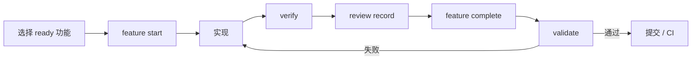

SDLC Harness 是面向开发者和编码 Agent 的仓库原生 SDLC 治理工具。它把需求、架构决策、功能状态、依赖关系和验证证据与代码放在一起，并用可执行门禁阻止不完整或不一致的交付。

```bash
npx @caesarlo/sdlc-harness adopt
```

<CardGroup cols={2}>
  <Card title="10 分钟接入" icon="rocket" href="/quickstart">
    在已有仓库或空仓库中生成协议，启用 Git hook，并完成第一个功能。
  </Card>
  <Card title="为什么需要它" icon="circle-question" href="/concepts/why-sdlc-harness">
    了解编码 Agent 跨会话和并行协作时常见的失效模式。
  </Card>
  <Card title="完整日常流程" icon="list-check" href="/guides/daily-workflow">
    从选择任务到验证、评审、完成和会话收尾。
  </Card>
  <Card title="命令参考" icon="terminal" href="/reference/commands">
    查询全部命令、参数、前置条件和状态变化。
  </Card>
</CardGroup>

## 它解决什么问题

编码 Agent 可以快速修改代码，但工作一旦跨越会话、设备或多个 Agent，常见问题就会出现：上下文只留在聊天里、功能被过早宣布完成、测试与需求失去关联、多个 Agent 同时修改同一任务。

SDLC Harness 让仓库成为唯一状态源：

- `AGENTS.md` 和 `docs/workflow/` 保存 Agent 的工作协议。
- `feature_list.json` 保存里程碑、功能、依赖、状态、claim 和证据。
- `sdlc-harness verify` 真实执行功能声明的验证命令。
- `sdlc-harness review record` 记录独立评审结论。
- `sdlc-harness feature complete` 原子检查完成条件并更新状态。
- `sdlc-harness validate` 审核整个仓库，并用非零退出码阻止不合规提交。
- `.harness/events/` 保存可随 Git 同步的追加式审计日志。

## 一条可信的完成链



<Important>
  `verify` 运行功能检查，`review record` 记录独立评审，`feature complete` 判断该功能能否完成，`validate` 审核整个仓库。它们不能相互替代。
</Important>

## 核心能力

<CardGroup cols={2}>
  <Card title="Agent 无关" icon="robot">
    Codex、Claude Code 和其他能读取仓库文件的 Agent 都能使用同一套协议。
  </Card>
  <Card title="证据绑定代码" icon="fingerprint">
    验证、评审和审批记录绑定 commit 或内容哈希，避免一句“已经通过”替代事实。
  </Card>
  <Card title="本地与 CI 同规则" icon="shield-check">
    Git hook 和 CI 运行同一个 `validate`，失败原因具有稳定分类。
  </Card>
  <Card title="支持并行协作" icon="people-group">
    claim、租约、WIP 上限和 Git worktree 降低多人、多 Agent 冲突。
  </Card>
  <Card title="端到端追溯" icon="link">
    把需求、用户故事、验收标准、功能和验证项串成可检查的矩阵。
  </Card>
  <Card title="交付后闭环" icon="rotate">
    环境检查、部署策略和反馈日志把流程延伸到运行与改进阶段。
  </Card>
</CardGroup>

## 适用边界

SDLC Harness 是协议和治理层，不是测试框架、编码 Agent、项目管理系统或需求正确性证明工具。它保证过程可追踪、证据可核验、规则可执行；实际产品判断、测试内容和部署命令仍由你的项目负责。

<Card title="开始接入" icon="arrow-right" href="/quickstart">
  把 SDLC Harness 接入仓库并完成第一条可信交付链。
</Card>
