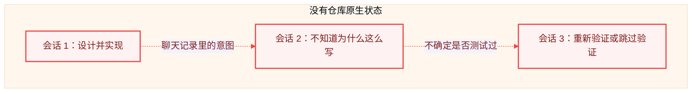
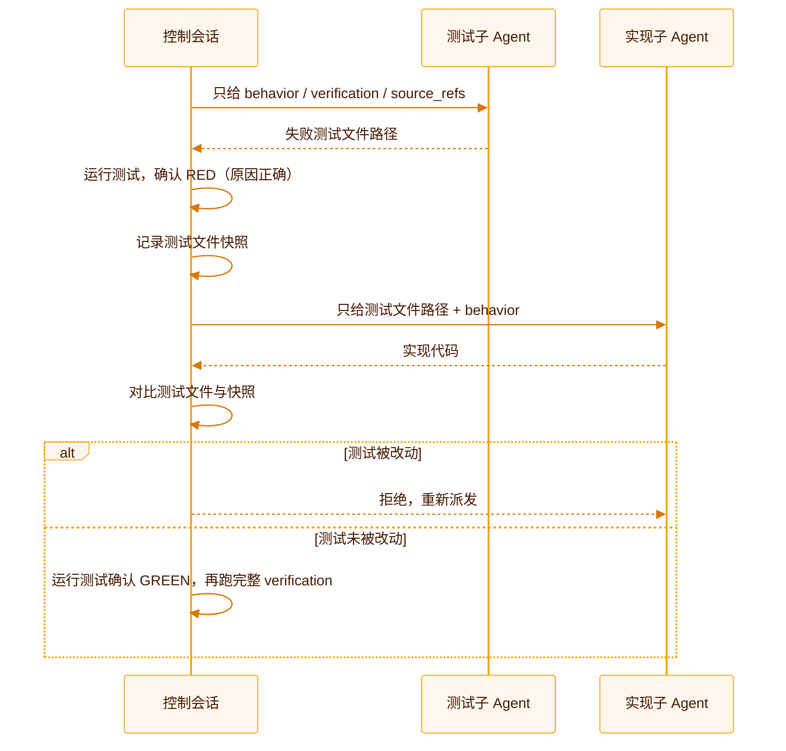

这一页回答一个更根本的问题：**如果没有 SDLC Harness，问题具体出在哪里？** 每一节都先描述一种真实会发生的失效模式，再说明对应机制如何降低风险、发现问题或阻止不合规状态。

## 失效模式一：进度只存在于对话里

编码 Agent 的会话是有边界的。一次对话结束、上下文被压缩，或者换了一个 Agent 继续同一个任务，“为什么改这个”“改到哪一步了”“还差什么”这些信息如果只存在于聊天记录里，就会随会话一起消失。下一个接手的人或 Agent 只能重新读代码、猜测意图，或者干脆重做一遍已经做过的分析。

SDLC Harness 把“为什么改、做到哪、验证过没有”直接写进仓库：`feature_list.json` 记录 `status`、依赖和证据，`source_refs` 把功能绑定回需求或 ADR 原文，`progress.md` 保留跨会话检查点。新会话不需要读懂整段历史，只需要读 `AGENTS.md` 规定的几个文件。

## 失效模式二：“完成”只是一句自我声明

Agent（以及人）都倾向于报告“已完成”“测试通过”，但这句话本身不能证明什么。如果完成情况只是一段自然语言描述，验收就退化成“相信对方说的话”。

SDLC Harness 不接受这种声明式的完成。`sdlc-harness verify <feature-id>` 实际执行功能声明的验证命令，把命令、退出码、时间戳和当前 commit SHA 一起写成证据；不能手写一条“通过了”的记录来冒充真实验证。`validate` 的 `[pass-gate]` 检查更进一步：一个 `passing` 功能必须同时具备验证证据和一条独立的 `kind: "review"` 证据——测试通过不能替代评审，评审也不能替代真实运行过的测试。

<Note>
  这两类证据分别回答“命令是否真的跑过并成功”和“是否有人按验收标准检查过实现”，两个问题互相不能替代。
</Note>

## 失效模式三：完成状态会悄悄倒退

一个功能今天标记为 `passing`，不代表它永远保持这个状态——后续改动可能在不经意间破坏它，而没有人注意到状态字段本身被改回了 `in_progress` 或者干脆被删除。如果校验只看当前这一份文件，这种倒退是看不出来的。

`validate` 的单调检查（`passing_is_monotonic`）会把当前 `status` 和一个 Git 基线做比较：优先使用 `HARNESS_BASE_REF`/`GITHUB_BASE_REF` 或 `origin/main`/`main`，本地没有基线时才退回本地快照。在全新的 CI checkout 中，只有 CI 获取了可解析基线并设置 `HARNESS_BASE_REF` 或 `GITHUB_BASE_REF`，该检查才能发现“之前通过的功能现在不再通过”这类回归；详见 [CI 与 GitHub 集成](/zh/guides/ci-and-github)。它不依赖某台开发机器本地缓存的历史记录。

## 失效模式四：测试是实现者自己写的

让写实现的人（或 Agent）也写测试，天然存在动机问题：断言可能被悄悄放宽，边界情况可能被跳过，测试可能只验证了“代码没有报错”而不是“行为符合预期”。这不是不诚实，而是同一个视角很难同时扮演裁判和选手。

默认的 `testStrategy: "isolated-tdd"` 把这两个角色物理分开：一个子 Agent 只根据功能的 `behavior`、`verification`、`source_refs` 写失败测试，不知道任何实现方案；控制会话确认测试先以预期原因失败（RED），并对测试文件做快照；另一个子 Agent 只拿到测试文件路径去实现，不接触第一个 Agent 的思路记录，也不能修改断言。控制会话在测试转绿后会把测试文件与快照比对，一旦发现被改动就拒绝这次实现。

规模明显小的功能（无分支逻辑、无外部依赖）可以跳过子 Agent 拆分、在同一会话内完成，但重构步骤和 review 门禁在所有 `testStrategy` 下都不能省略。

## 失效模式五：多个 Agent 同时认领同一件事

并行运行多个 Agent 是提升吞吐量的直接办法，但没有协调机制时，两个 Agent 很容易挑中同一个“看起来可以做”的功能，各自实现一遍，最后要人工合并冲突、丢弃重复工作。

SDLC Harness 用 `claim` + 租约把“认领”变成一个原子操作：`claim --next` 只会选中 `not_started`、依赖全部 `passing`、且没有被有效 `claim` 占用的功能；`wip_limit_per_owner` 限制单个 `owner` 能同时打开的功能数，默认为 1，避免开了很多头却都没做完。Git 本身没有实时跨机器锁，所以两台机器仍可能在本地同时认领同一功能——`claim --push` 用“提交并推送，推送被拒就丢弃本地 `claim`、重新同步、自动改认领下一个就绪功能”这套流程，把冲突检测推迟到真正会发生冲突的那一刻（push），而不是假装可以提前用锁避免它。独立的 `workspace create` 再给每个 `claim` 一个隔离的 `worktree` 和分支，让并行的多个 Agent 不会在同一份工作树上互相踩踏。

## 失效模式六：规则只存在于文档里，没人真正执行

“提交前必须跑测试”“完成需要评审”这类规则，如果只写在贡献指南里，执行力取决于每个人有没有记住、愿不愿意照做。人可能会忘，Agent 更可能在长会话里丢失这条约束。

`sdlc-harness validate` 把这些规则变成一个失败时返回非零退出码的命令。启用本地 `.githooks/pre-commit` 和生成的 CI 工作流后，两者会运行相同的审核逻辑；不合规状态会返回非零退出码，并可阻止提交或合并。如果检出的历史、基线引用、配置或环境不同，本地与 CI 结果仍可能不同。

## 跟不用这套机制相比，实际差在哪

这些机制不是全新发明，而是把几种已经在工程实践里被验证有效的思路，落到“编码 Agent 协作”这个具体场景里：状态该放哪、完成该怎么证明、并发该怎么协调、回归该怎么发现。下面是同一件事在“没有仓库原生治理”和“有 SDLC Harness”下的实际差异：

| 环节 | 没有这套机制时的实际做法 | SDLC Harness 下的做法 |
| --- | --- | --- |
| 当前状态存在哪 | 聊天记录、Issue 描述、开发者脑子里，三者经常不一致 | `feature_list.json` 是唯一状态源，任何会话都能读到同一份 |
| “完成”怎么证明 | 一句“测试通过了”或“应该没问题” | 一条包含命令、退出码、时间戳、commit SHA 的证据记录，加一条独立的评审记录 |
| 本地和 CI 是否一致 | 本地跑一遍，CI 再跑一遍，规则可能悄悄不同步 | 启用本地 Git hook 和 CI 后，两者执行同一套 `validate` 逻辑；检出历史、基线引用、配置或环境不同仍可能产生不同结果 |
| 回归怎么发现 | 依赖有人记得、有人恰好翻到旧记录 | `validate` 与可解析 Git 基线比较；全新 CI checkout 必须获取基线并设置 `HARNESS_BASE_REF` 或 `GITHUB_BASE_REF` |
| 多个 Agent/开发者抢同一件事 | 靠口头协调或事后合并冲突 | `claim` 把“认领”变成一次原子操作，冲突在 push 那一刻被检测并自动改派，而不是靠提前加锁 |
| 谁写代码谁写测试 | 同一视角既当选手又当裁判，断言容易被悄悄放松 | 默认拆成两个互不知情的角色，测试文件在实现阶段被快照比对，防止事后被改松 |

这几条分别对应几种在软件工程里已经被反复验证的做法：把可变更的运行状态收敛到一个声明式的、可重放的位置，而不是分散在多处容易漂移的地方；完成条件要能被自动检查，而不是停留在人工确认；变更引入的证据要能追溯到具体的命令和产物，而不是一句转述；并发协调优先假设“大概率不冲突”，在真正提交的那一刻才做代价最高的检查，而不是一开始就上重量级的锁。SDLC Harness 把这几件事都收进同一个仓库、同一套退出码里，不需要额外部署协调服务，也不需要团队成员都记住同一套约定。

## 这些机制加在一起解决什么

单独看，`claim`、证据、单调检查、隔离 TDD 都是很局部的机制。放在一起，它们把“Agent 协作是否可信”这个问题从“相信对方的自我报告”变成“仓库里有没有可验证的记录”：

<CardGroup cols={2}>
  <Card title="状态可恢复" icon="rotate">
    任何时刻中断，下一个会话都能从仓库读回完整上下文，不依赖聊天记录。
  </Card>
  <Card title="完成有证据" icon="fingerprint">
    `passing` 背后必须有真实运行过的验证命令和独立的评审记录。
  </Card>
  <Card title="回归可发现" icon="arrow-trend-down">
    [全新 CI checkout](/zh/guides/ci-and-github) 获取可解析基线并设置 `HARNESS_BASE_REF` 或 `GITHUB_BASE_REF` 后，Git 基线比较可以发现 `status` 回退。
  </Card>
  <Card title="规则可执行" icon="gavel">
    启用本地 hook 和 CI 后，同一套审核会让不合规状态返回非零退出码，并可阻止提交或合并。
  </Card>
</CardGroup>

<Card title="看它具体怎么运作" icon="diagram-project" href="/zh/concepts/how-it-works">
  了解仓库状态、功能生命周期和九阶段工作流的具体机制。
</Card>
